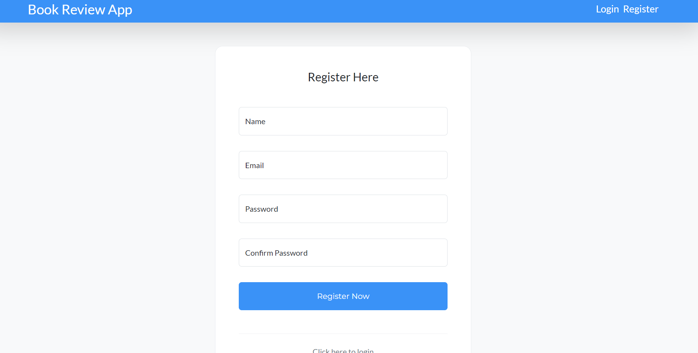
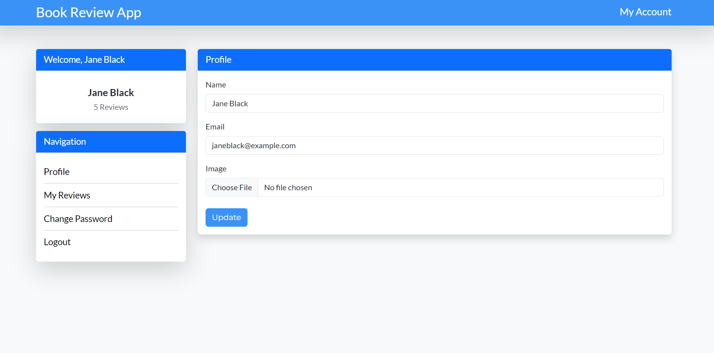
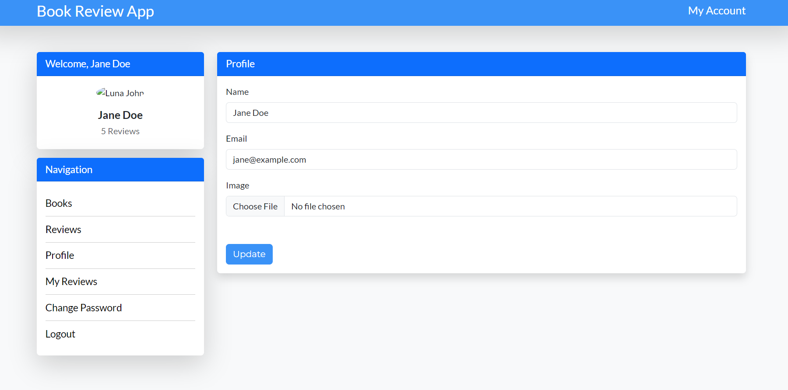
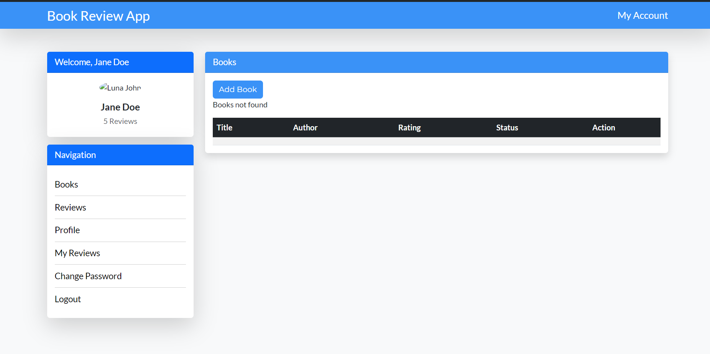
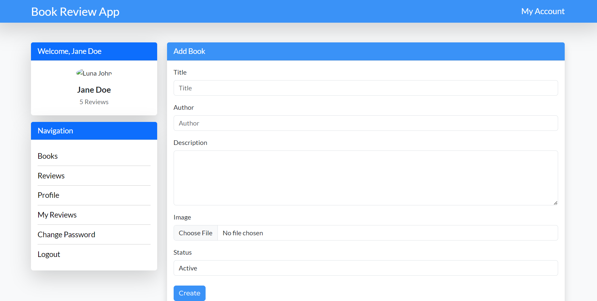
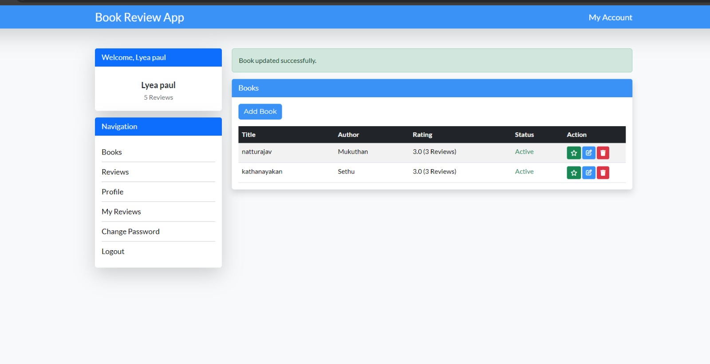

# Book Review App - Laravel Project

## Intro to Your Project

Our group developed a book review app using Laravel, designed to provide a platform for book enthusiasts to share their thoughts on the books they've read. The app categorizes users into two types: normal users, who can submit and manage their reviews, and admins, who have the additional capability to view user details, manage all books, and oversee the reviews submitted by users. 

## Features and Database Schema

### Features
1. **User Authentication:** With regular users and admin. Users can manage their profile, add books and review them and admin can access user details, rreviews, manage books.

2. **Book Management:** Users can add books to the app's library. Admins have the authority to manage this library, ensuring that all entries are accurate and up to date.

3. **Review System:** Users can write reviews for books they have read. Reviews are associated with the book and the user who submitted them. Admins can moderate reviews, ensuring that the content remains appropriate and relevant.

### Database Schema
- **Users Table:** Contains user information such as `id`, `name`, `email`, `password`, and `user_type` (to differentiate between normal users and admins).
- **Books Table:** Stores details about each book, including `id`, `title`, `author`, `description`, `image`

## Screenshots to Demo the User Flow
Creating new user or login in usin an existing account details

The profile page with setail of usr name and email which can be changed an updated

The user profle has additional menu option on the sidebar for admin user

Books Option gives book lists and option to add book
Books list page befor assing books

Adding book page

Book list after adding book

## Incomplete Features and Challenges

While we were able to ad most of the core features of CRUD functionality, we are faced with some errors on Delete funcionality which e are trying to resolve. We were also unable to sucessfully incorporate image uoload function.

## Thoughts on Laravel and Additional Learning

Laravel is a powerful PHP framework that simplifies many aspects of web development, such as routing, authentication, and database management. To enhance your learning, consider delving into testing with PHPUnit, API development, and performance optimization. Exploring ecosystem tools like Laravel Forge for deployment can also be valuable.
